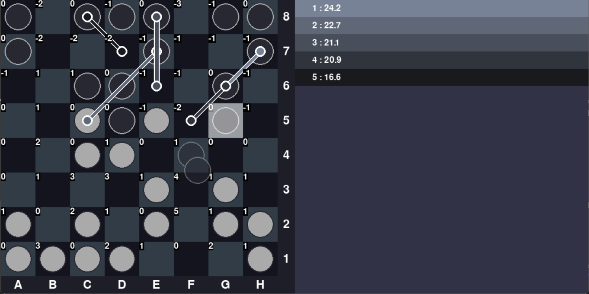
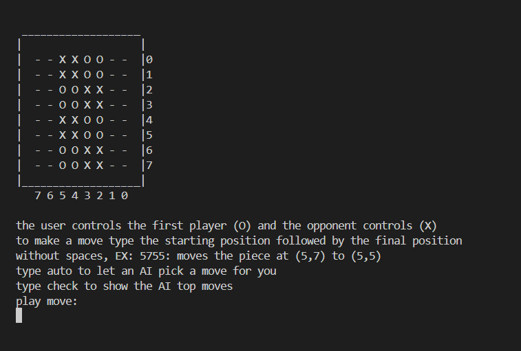

# Board-game
 An application with a simple AI scoring different moves of the board game based on heuristics. It uses simple statistical methods to decide the moves which are more likely to win, using a depth first search with pruning.


<p align="center"> python interface during gameplay </p>


<p align="center"> c++ interface during gameplay </p>

## interfaces
 ### Python
 The python version runs using the board_cpp.dll as a backend but provides a nice interactive GUI to play the game or simulate ai matches. There is also a couple of extra development files to compile the c++ dll and to adjust the weights of the AI based on previous games.

 ### C++
 Mostly functions as a backend for the python version. However, it also includes a console app which allows the user to play the game directly in the c++ version. Also includes a function that allows the user to autoplay battles while dumping their data into files to optimize using the python file.


 ## How to play
 ### Win condition
 Make sure the other player has no legal moves on their turn
 ### Legal moves
 Each turn players can make a move that may land one of their pieces either on an empty space or a space with an opposing piece removing it from play.
 There are 2 types of moves:
 #### Diagonal moves
 Move any of their pieces over one or more of their other pieces in one straight diagonal line
 #### Circular moves
 Move any of their pieces that is orthogonally adjacent to one of their other pieces to another place which is also orthogonally adjacent to that second piece as long as it can be moved by sliding the second piece around the first piece (the corners aren't blocked)

### Extra rules
- There are no draw conditions in this game
- If a player repeates the same move (use the same move to return to the same board state) they should be eliminated (currently not implemented)

## How to use
### Python
using python 3.11 (but earlier versions may work)

it is recommended to use a virtual environment

go to the main directory and install requirements.txt:

```shell
pip install -r requirements.txt
```

then go to the src directory and run main.py

#### Controls:
- LMB	:Move a piece
- F2	:Toggle Assist
- F3	:Toggle control overlay
- Q		:Toggle player 1 AI
- A		:Toggle player 2 AI
- S		:Play AI move
- R		:Reset the game

### C++
Run the executable in `board_cpp/build` or compile, build and execute the solution
- The controls are described at the beginning of the terminal
- The game runs in interactive mode by default, currently the rest of the functionality is hardcoded and requires hardcode changes.

### recompiling c++ dll:
all c++ components were compiled with g++

Note: this reuires installing the python libraries as well

from the main directory run:
```shell
invoke buildBoardTask
```

or from `board_py/src/tasks.py` reconstruct the necessary shell code
